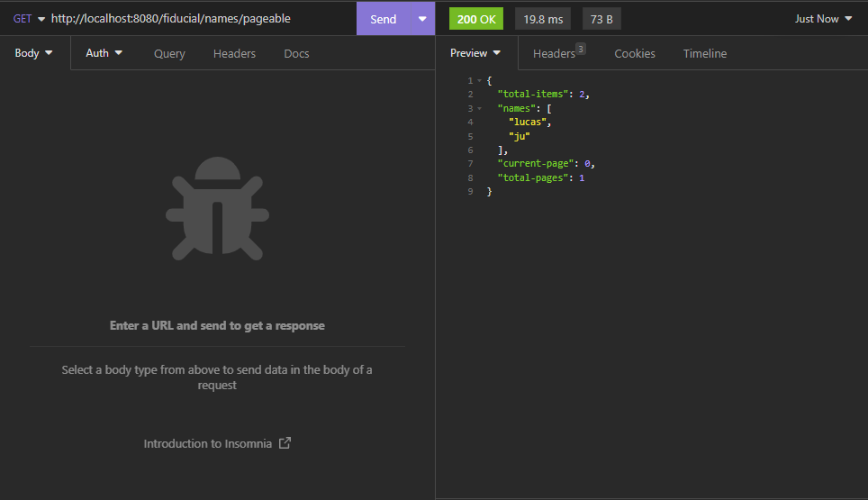
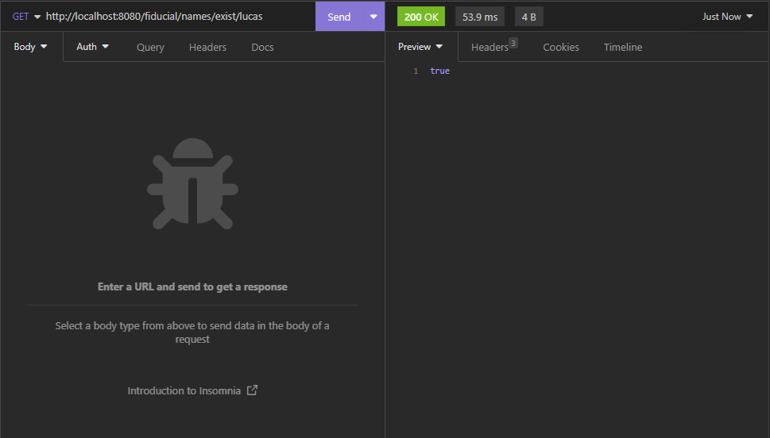
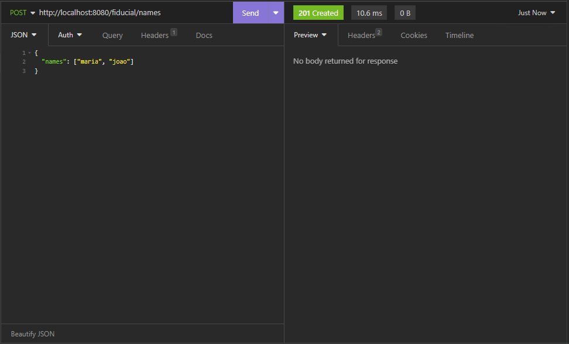

# Fiducial
* This project uses:
  * Spring 3
  * Java 17
  * Swagger
  * Postgres
  * Ehcache | Jcache

### Names API | Endpoints:

* GET http://localhost:8080/fiducial/names/pageable?page=0&size=20
  * Parameters:
    * page (integer)(query) - Default value = 0
    * size (integer)(query) - Default value = 10
  * Response:
    * 
* GET http://localhost:8080/fiducial/names/exist/{name}
  * Parameter:
    * name *required (string)(path)
  * Response:
    * 
* POST http://localhost:8080/fiducial/names
  * Request body *require (application/json):
    * 

### Features to improve performance
* We're using pagination in GET/fiducial/names/pageable
* We are using cache in Entity Name.

### Video with swagger demonstration:
* 

